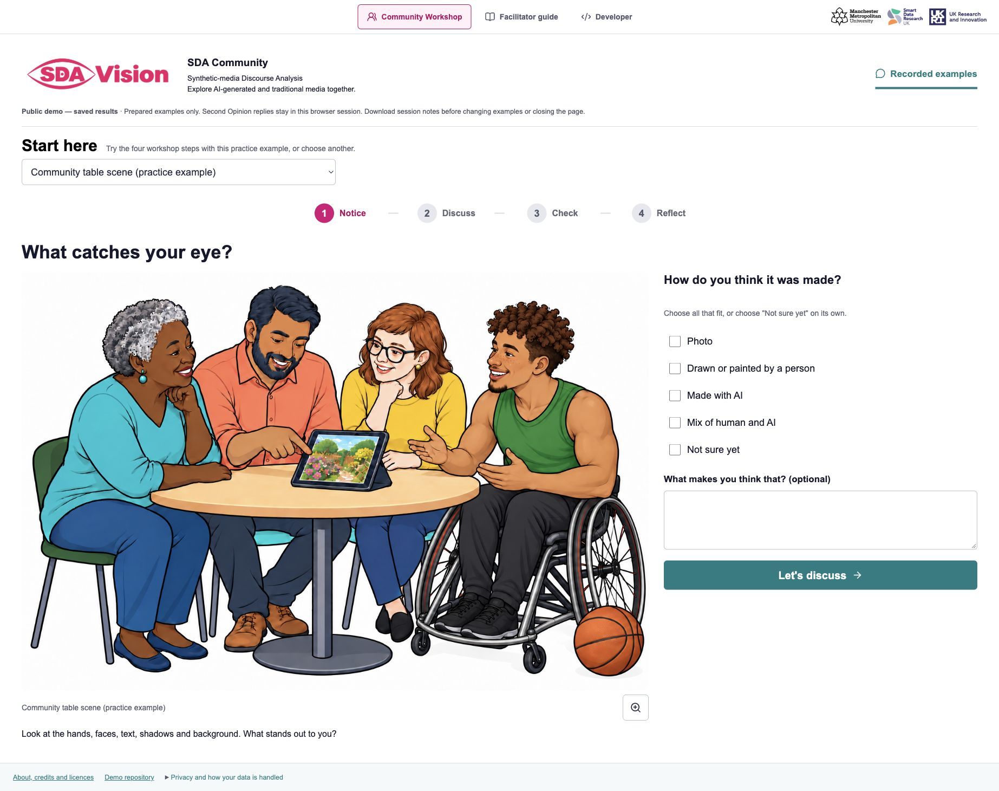
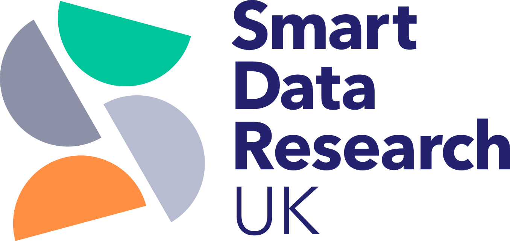

# SDA Vision — version 0.1.2

 · 

Software and guide badges link to the latest published version in their separate Zenodo series.

SDA means **Synthetic-media Discourse Analysis**. This software brings model interpretations, content credentials, local file observations and human reflection together for research and community workshops exploring AI-generated and traditional media.

An academic research project of **Synthetic Realities**, led by **Dr Sam Martin**, Smart Data Research UK (UKRI) Fellow (Grant number UKRI4010.), Manchester Metropolitan University (MMU). [ORCID](https://orcid.org/0000-0002-4466-8374).

This work was supported by Smart Data Research UK, a UKRI investment; Grant number UKRI4010.

[Explore the live demo](https://sdavision.io/) · [Facilitator guide](docs/Facilitator_Guide.md)

Google Lens is available for image files. PDFs, slides, podcasts and videos retain their original-file downloads, with image-search controls reserved for images. [Image-search scope](docs/Image_Search_Scope_2026-09-29.md).

Reflect keeps its findings and Evidence box inside **Revisit the recorded findings**, collapsed until opened. Session notes and New session remain visible. [Software 0.1.1 release details](release/RELEASE_0.1.1.md).

## Start here

The [public demo](https://sdavision.io/) opens Community Workshop with saved assessments. This archive installs the local Research app, including local file selection and provider configuration. The approved-example Conference profile is a separate configuration.

1. Install Python 3.11+ and Node 20.19+ (20.x) or 22.12+. The current macOS dependency lock uses native Apple Silicon Python. Other architectures need separate validation.
2. Use GitHub’s Code menu to download or clone the current source. The [published Zenodo archive](https://zenodo.org/records/23039037) retains version 0.1.1 while the next deposit is prepared. Extract to a writable folder and open Terminal in the folder containing `setup.sh`.
3. Run `./setup.sh`. This installs the pinned Python dependencies, installs frontend dependencies and builds the interface. Set `PYTHON=/path/to/native/python3` when the default Python is a different architecture.
4. Add approved provider keys to the newly created `.env` when you want live model calls. See `.env.example` and [provider configuration](docs/Provider_Upgrade_2026-09-24.md).
5. Run `./run.sh`, or double-click `boot-vision.command` on macOS. The launcher prints a localhost address, choosing an available port from 8100. It starts the installed copy without rebuilding it.

FFmpeg supports local media preparation. Full previews of uploaded PowerPoint files use optional [LibreOffice](docs/PowerPoint_Preview_Setup.md). The bundled teaching deck has prepared slide previews.

## Explore and review

Community Workshop follows Notice, Discuss, Check and Reflect. Developer provides provider evidence, a collapsed Batch queue and exports. [Analysis citations](docs/Batch_And_Citation_2026-09-28.md) credit Dr Sam Martin in Harvard style, with the Smart Data Research UK acknowledgement and grant UKRI4010. The [facilitator field guide](docs/guides/SDA_Vision_Facilitator_Guide_v1.5.pdf), version 1.5, supports people leading group discussion about AI-generated and traditional media. Its editable conference PowerPoint is a separate local working file and is excluded from this deposit.

Images, sampled video frames, PDF pages, slide images and audio transcripts have distinct scopes. Three visual/text models contribute according to the [versioned agreement rules](docs/Method_Change_Record_2026-09-26.md). Inconclusive replies remain undecided; ratings are not calibrated probabilities. Supporting file observations, pasted second opinions and audio descriptions are distinct evidence. AI-origin detection from the sound itself is outside this workflow. The graph maps analysis relationships or image similarity; distribution history is not assessed.

## Data, rights and citation

Read [privacy and data flows](PRIVACY.md) and [security contact](SECURITY.md) when setting up your research workflow. Local research reports are unencrypted until deleted. Provider accounts, terms and charges apply to configured external requests.

The project code and documentation use the [MIT licence](LICENSE). [Example credits and permissions](examples/CREDITS.md), [dependency notices](third_party/README.md) and [partner-logo rights](docs/branding/README.md) identify separate terms. Included examples are ten selectable media items plus the opening practice illustration. The withdrawn illustration, credentials, private data, Git history and private facilitator source key are excluded.

Martin, S. (2026) *SDA Vision: Synthetic-media Discourse Analysis* (version 0.1.2) [Computer software]. Manchester Metropolitan University. Available at: https://github.com/Synthetic-Realities/sda-vision-source. The software [Concept DOI](https://zenodo.org/doi/10.5281/zenodo.23008102) links to the latest Zenodo publication. Machine-readable citation: [CITATION.cff](CITATION.cff). Public software repository: [Synthetic-Realities/sda-vision-source](https://github.com/Synthetic-Realities/sda-vision-source). Public [demo repository](https://github.com/Synthetic-Realities/sda-vision-demo).

## Verification

`ARCHIVE_MANIFEST.json` lists SHA-256 hashes for the release files, excluding the manifest itself. [Software 0.1.1 release details](release/RELEASE_0.1.1.md) describe the image-search scope and Reflect review. [Current acceptance checks](release/ACCEPTANCE_0.1.2.md) identify the interface and export verification for 0.1.2. Previous installation evidence retains its release date. [Release origin](RELEASE_ORIGIN.md) retains the original 0.1.0 baseline.

## Affiliation and funding

 &nbsp;  &nbsp; 

Smart Data Research UK (UKRI) Fellowship, Grant number UKRI4010, hosted at Manchester Metropolitan University. Partner logos identify the affiliation and funding; their rights remain with their owners.

## Podcast source exploration

The final, source-informed workshop verdict is **Mix of human and AI**: human-authored research, selected by the researcher and adapted into a podcast with Google NotebookLM. Following the cover citation, finding the publication and comparing a podcast statement with the paper helps the group reach a fuller Human–AI reflection. The recorded transcript ratings and separate audio-excerpt description remain available with their original scope; they inform the discussion alongside the additional source evidence.

The podcast activity invites participants to follow the cover citation, search for the publication and compare a statement with its source. [Activity and source details](docs/Podcast_Source_Activity.md). The [seven-page facilitator guide, version 1.5](docs/guides/SDA_Vision_Facilitator_Guide_v1.5.pdf), includes this exercise. Session PDF and PowerPoint previews use the displayed media artwork where available.

[Software 0.1.2 and facilitator guide 1.5 distribution notes](release/RELEASE_0.1.2.md).
