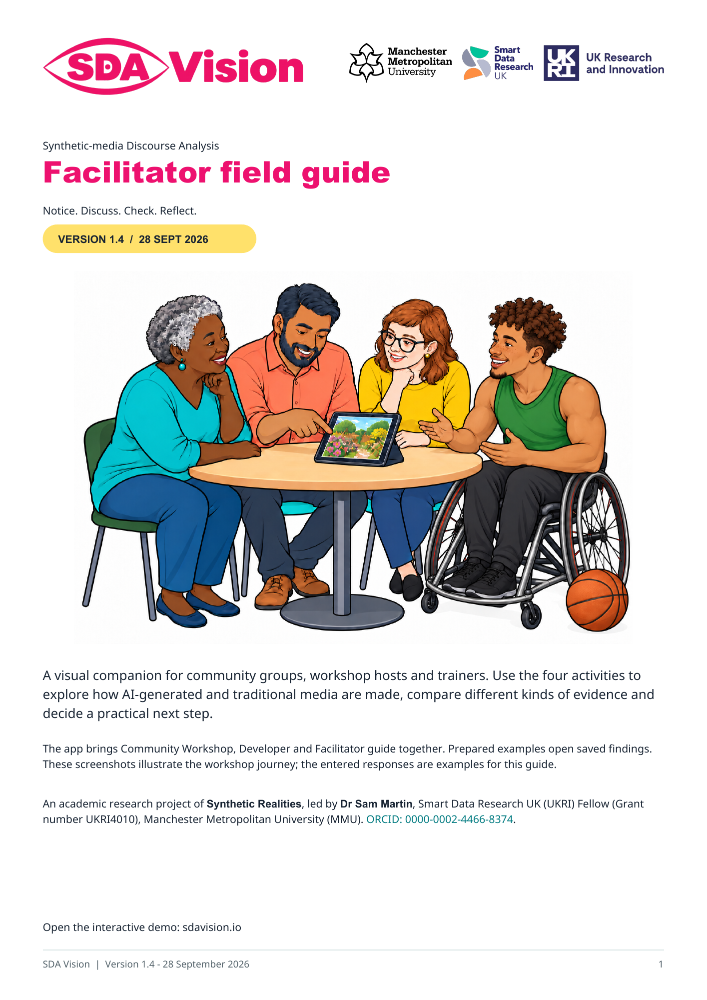
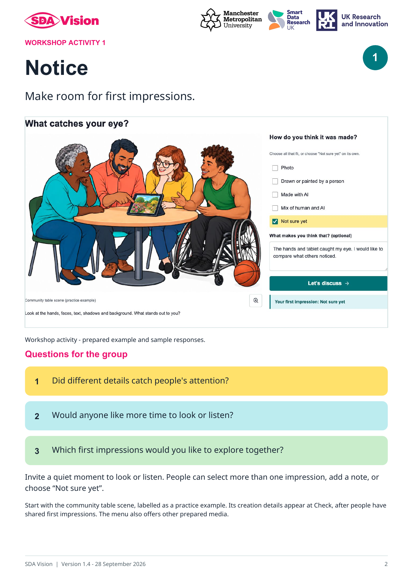
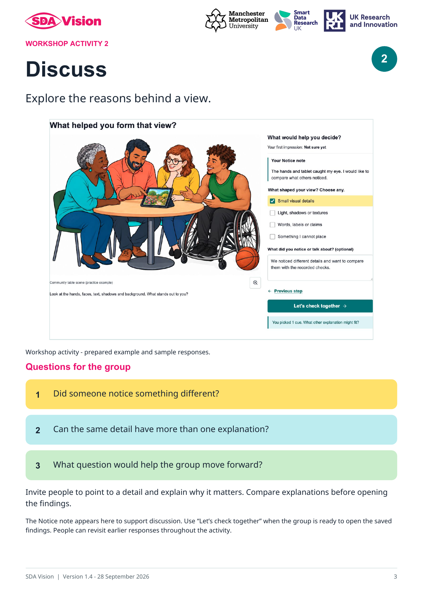
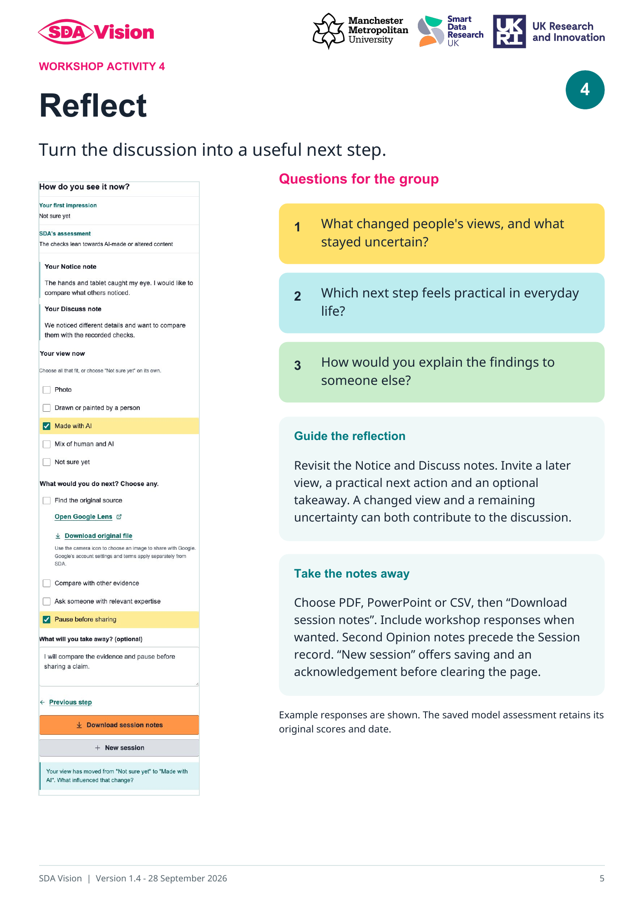

# SDA Vision: Facilitator field guide — version 1.4

SDA means **Synthetic-media Discourse Analysis**.

An academic research project of **Synthetic Realities**, led by **Dr Sam Martin**, Smart Data Research UK (UKRI) Fellow (Grant number UKRI4010), Manchester Metropolitan University (MMU). [ORCID: 0000-0002-4466-8374](https://orcid.org/0000-0002-4466-8374).

[Download the six-page facilitator guide (PDF)](guides/SDA_Vision_Facilitator_Guide_v1.4.pdf).

For community facilitators, trainers, educators and researchers leading workshops, conference sessions and online discussions about AI-generated and traditional media. Use the guide alongside SDA Vision’s **Community Workshop**, adapting the questions to your group. The four activities invite first impressions, comparison of ideas, exploration of recorded findings and practical next steps.

Start with the clearly labelled practice illustration or choose an example for which you have permission. Participants can record a first impression before seeing the project’s creation note at Check. The model table offers expandable evidence, while **About this file** summarises any embedded creation labels. Podcasts separate the assessed transcript excerpt from observations about sound.

The guide includes the four activity pages below. Read the preparation notes before a session; at the end, invite reflection and download session notes before using **New session**. Responses and pasted Second Opinion notes remain separate from the recorded model findings.

## Workshop Activity 1 — Notice

## Workshop Activity 2 — Discuss

## Workshop Activity 3 — Check

## Workshop Activity 4 — Reflect

## Version and publication

Version 1.4, prepared 27 September 2026 with the scope wording reviewed on 28 September, accompanies the current interface. The PDF is distributed with the GitHub demo and source repository. Its Zenodo draft has reserved DOI **10.5281/zenodo.23008189**, which registers on publication. The editable conference PowerPoint is separate and is excluded from this pack.

The original media and analysis records have separate credits and scope. The withdrawn Illustration 2 is excluded from the current example catalogue; it does not appear in this guide. The practice illustration remains available.

## Affiliation and funding

  

Smart Data Research UK (UKRI) Fellowship, Grant number UKRI4010, hosted at Manchester Metropolitan University. Logo rights remain with their owners. See [licence](../LICENSE) and [artwork credits](branding/README.md).
