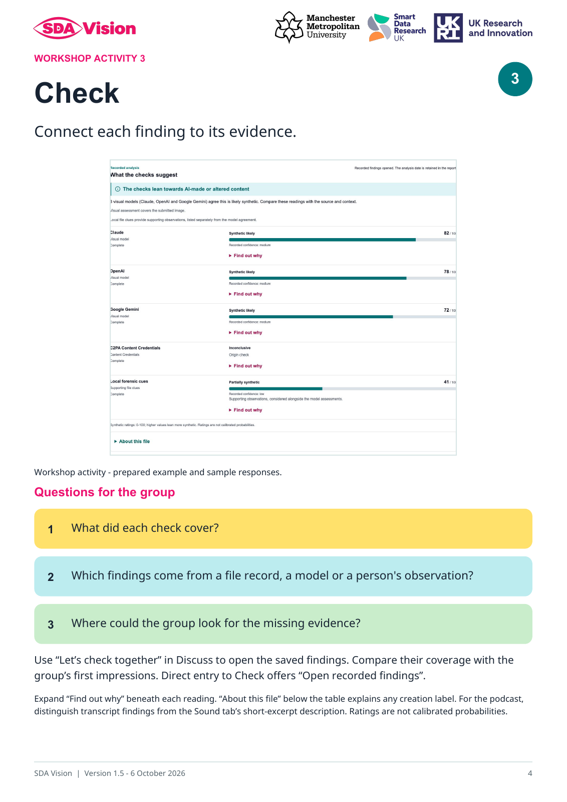

# SDA Vision: Facilitator field guide — version 1.5

SDA means **Synthetic-media Discourse Analysis**.

An academic research project of **Synthetic Realities**, led by **Dr Sam Martin**, Smart Data Research UK (UKRI) Fellow (Grant number UKRI4010), Manchester Metropolitan University (MMU). [ORCID: 0000-0002-4466-8374](https://orcid.org/0000-0002-4466-8374).

[Download the seven-page facilitator guide (PDF)](guides/SDA_Vision_Facilitator_Guide_v1.5.pdf).

For community facilitators, trainers, educators and researchers leading workshops, conference sessions and online discussions about AI-generated and traditional media. Use the guide alongside SDA Vision’s **Community Workshop**, adapting the questions to your group. The four activities invite first impressions, comparison of ideas, exploration of recorded findings and practical next steps.

Start with the clearly labelled practice illustration or choose an example for which you have permission. Participants can record a first impression before seeing the project’s creation note at Check. The model table offers expandable evidence, while **About this file** summarises any embedded creation labels. Podcasts separate the assessed transcript excerpt from observations about sound.

The guide includes the four activity pages below. Read the preparation notes before a session; at the end, invite reflection and download session notes before using **New session**. Responses and pasted Second Opinion notes remain separate from the recorded model findings.

## Workshop Activity 1 — Notice

## Workshop Activity 2 — Discuss

## Workshop Activity 3 — Check

## Workshop Activity 4 — Reflect

## Podcast: follow the source

The NotebookLM podcast draws on research published by Sam Martin and Samantha Vanderslott in *Vaccine*. Its cover contains the publication citation. The activity separates how the podcast was produced, what it draws on, and how faithfully it represents the source.

| Step | Invitation |
| --- | --- |
| Notice | Listen to a short section. What shapes your first impression of how this podcast was made? |
| Discuss | Take a closer look at the cover image. Which names, dates or references could help you trace its source? |
| Check | Search for a distinctive phrase from the title or the authors’ names. Can you find the publication? Choose one statement from the podcast and compare it with the paper. |
| Reflect | What have you learned about the research and about the podcast’s production? How would you describe both when sharing it? |

[Search Google for the publication](https://www.google.com/search?q=%22Martin%22%20%22Vanderslott%22%20%22mask%22%20%22vaccine%22) · [Read the research paper](https://doi.org/10.1016/j.vaccine.2021.10.031). In the app both links open a new tab. The search sends the public author names and topic to Google; it sends no recording, transcript or participant responses.

After first impressions, participants can open **Explore the source behind this example** at Check or Reflect. Dr Sam Martin supplied the creation record: she made the podcast with Google NotebookLM using the research she co-authored with Samantha Vanderslott. A publication match establishes a source connection; comparing statements helps assess how the adaptation summarises, simplifies or extends the research.

The saved findings assess the first 12,000 characters (about 46%) of the transcript. AI-origin detection from the sound itself is outside this workflow. The 78, 90 and 95/100 model ratings are not calibrated probabilities. The source activity and participant reflections remain separate from those findings.

The session PDF and PowerPoint include the displayed cover or document preview where available, with a caption distinguishing it from analysed frames. The source reveal enters the session summary only after it has been opened. Original reports and their thumbnails remain unchanged.

## Version and publication

Version 1.5, prepared 6 October 2026, includes the podcast source-tracing activity. This version is available from GitHub and the website. The [guide Concept DOI](https://zenodo.org/doi/10.5281/zenodo.23008188) currently resolves to the published 1.4 record; the 1.5 deposit pack is prepared separately. The editable conference PowerPoint remains outside release packs.

## Affiliation and funding

  

Smart Data Research UK (UKRI) Fellowship, Grant number UKRI4010, hosted at Manchester Metropolitan University. Logo rights remain with their owners. See [licence](../LICENSE) and [artwork credits](branding/README.md).
