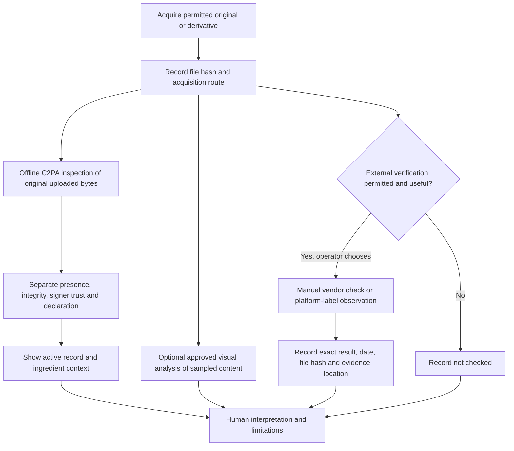

# Platform Provenance: Conference And Research Scope

Evidence checked: 24 September 2026. This is a capability scope, not a platform
accuracy benchmark. The existing Claude/OpenAI/Gemini panel is unchanged.

## The Short Answer

SDA can analyse supported files from different sources and inspect embedded
Content Credentials. It cannot reliably identify every generator, recover all
stripped credentials, or determine whether a public-health claim is true.
Accepting a file is not the same as verifying its origin.

Keep five identities separate: **where it was found, which app exported it,
which model was declared, who signed it, and who originally created it**.
These may all differ. A platform name is context, not a new detector or a vote.

## Platform Matrix

Vendor statements below are evidence about their products, not proof about every
file. The final two columns describe SDA's implementation and proposed testing.

| Platform | Verified vendor position | What SDA can do now | Boundary and next check |
|---|---|---|---|
| ByteDance / Dreamina | Dreamina describes C2PA credentials, invisible watermarks and visible AI labels as distinct transparency measures. [Official announcement](https://dreamina.capcut.com/resource/seedance-2-5-launch) | Read embedded credentials in an original supported file; display active export and embedded ingredient histories separately. One researcher-supplied MP4 was inspected locally. | No ByteDance watermark detector has been integrated. A named Dreamina tool is not an explicit AI declaration. Test new originals, edited exports and social copies independently. |
| Adobe / Firefly | Adobe documents Content Credentials for wholly AI-generated images, including indications of partner-model use. [Adobe partner-model guidance](https://helpx.adobe.com/creative-cloud/apps/generative-ai/non-adobe-models-in-adobe-products.html) | Inspect signed declarations and available ingredient context. The existing Firefly JPEG and an in-memory tampered variant exercise the real SDK. | Adobe export does not imply Firefly generation. Test fully generated, generative-fill, camera-only and partner-model outputs. Do not infer the whole document from one ingredient. |
| Runway | Runway states that outputs from its own models carry C2PA credentials on every plan; its interface also offers third-party models. [Runway FAQ](https://runway.com/product/ai-video-generator) | One researcher-confirmed Runway-hosted Seedance export was tested. Embedded credentials declared BytePlus/Seedance, not a Runway first-party model; integrity validated but signer trust was not established. | First-party Runway output remains untested here. Keep hosting interface, declared model and signer separate. Do not extend one export's outcome to every hosted model or derivative. |
| Midjourney | Its public checker validates a hidden file ID tag; missing metadata does not exclude Midjourney origin. Screenshots, edits and social sharing can remove it. [Midjourney documentation](https://docs.midjourney.com/hc/en-us/articles/48207461163661-Content-Authenticity) | Analyse visible content using the existing panel. An operator can separately use the vendor's checker on an approved original and record its exact response. | No automated Midjourney checker integration, public verification API, or C2PA equivalence is established by that documentation. A generation API would not imply verification access. |
| LinkedIn | LinkedIn displays available C2PA credentials on signed image/video posts, including the declaring app/device and issuer. [LinkedIn Help](https://www.linkedin.com/help/linkedin/answer/a6282984) | Inspect the bytes of a downloaded supported file; record the observed platform label separately in a research log. | LinkedIn is the distribution context, not necessarily the generator or signer. Its displayed label does not prove a downloaded derivative retained the same credentials. No account scraping or platform API connection is added. |
| Higgsfield | Visible branding and invisible machine-readable markers are separate; its guidance says the latter may be embedded. [Higgsfield guidance](https://higgsfield.ai/creator-hub/help-center/credits/watermark-and-how-to-remove) | One researcher-confirmed export opened and completed four-frame analysis. Local inspection found an unsigned container AI declaration, but no embedded C2PA. | SDA does not yet display this unsigned container tag. It must not become a trusted provenance override; the selected generation model remains unconfirmed. |
| Suno | Suno documents a C2PA checker and public developer API, not a general AI detector. [Suno Credentials](https://suno.com/suno-credentials) | One original MP4 had valid integrity but unresolved local signer trust; an explicitly authorised API request returned HTTP 200 / `verified_suno`. Local soundtrack inspection and optional consented checks are now implemented. | This is one compatibility observation, not general MP4 support or acoustic AI detection. Vendor verification and local trust remain separate. See the [soundtrack workflow](Audio_Workflow_2026-09-24.md). |

These platforms are a focused starting set, not an exhaustive list. Meta, Grok, YouTube
and other services need their own dated source review and original/derivative
tests before being described as supported verification integrations.

## Evidence Tracks

| Track | Example | What the result means | What it does not mean |
|---|---|---|---|
| File-bound provenance | Embedded C2PA manifest | An SDK validation result and attributed declarations under a recorded trust policy | Scene truth, clinical validity, or a calibrated AI probability |
| Unsigned file metadata | PNG XMP AI source type or MP4 AIGC tag | An editable declaration present in the exact inspected file | A verified signer, C2PA validation or a detected invisible watermark |
| Vendor verification | An operator uses a platform's authorised checker | That service's response about the exact submitted file, at that time | An SDA-integrated detector or independent replication |
| Platform observation | A researcher opens LinkedIn's credentials panel | A recorded interface observation tied to a post and capture time | Cryptographic validation of a screenshot or downloaded copy |
| Interpretive analysis | Existing three vision LLMs inspect sampled frames | Model judgements with recorded limits and disagreements | Direct watermark detection or complete video coverage |

Do not count these as independent votes. The vendor checker, social label
and original manifest may repeat the same underlying claim.

The unsigned-metadata row extends the original four-track scope: local inspection
found these declarations in the new evaluation files, but displaying them in SDA
is proposed work, not an implemented fifth provider.

## Processing Map



The offline inspector is separate from normal Run analysis: the latter can send
sampled content to configured cloud providers. No external upload is automatic
in this proposed platform-check workflow. Do not send restricted research media
to a checker merely because it is public or free.

## Practical Test Plan

Start with one authorised original per creation workflow, not dozens of models.
Keep masters unchanged. Give each derived copy a new ID and hash.

| Order | Test | Record | Pass condition |
|---|---|---|---|
| 1 | Original download | App, selected model if known, export version/date, hash, rights | File opens; C2PA outcome is explicit even when absent or untrusted |
| 2 | Locally resized image or re-encoded video | Exact transformation, parent ID, new hash | No automatic inheritance of the original's credentials or conclusion |
| 3 | Screenshot or screen recording | Capture route, crop, scale and parent ID | Treated as a new file; no claim of universal watermark survival |
| 4 | Platform upload/download round trip, only where approved | Original, observed label, acquired derivative, time | Platform observation and local verification remain separate |
| 5 | Mixed-content figure, PDF or PPTX | Which elements were AI-generated; extraction coverage | Ingredient/frame evidence is not presented as whole-document truth |
| 6 | Non-AI and tampered controls | Documented origin or exact in-memory alteration | Missing credentials are not labelled fake; broken signatures cannot override |

Use [PLATFORM_TEST_RECORD.csv](../release/PLATFORM_TEST_RECORD.csv). Rows are
templates, not passes. Keep confidential screenshots, files and post identifiers
in approved private storage; use public-safe evidence references in the release.

For local provenance-only inspection from the project root:

```bash
.venv/bin/python scripts/inspect_provenance.py "examples/YOUR_APPROVED_FILE.mp4"
```

It writes a private timestamped report under `.review-cache/provenance`, reads the
original bytes, checks their SHA-256 before/after and calls no vision LLM.

## Screenshot And Watermark Caveat

A screenshot is not the original signed container. Embedded credentials, a vendor
file tag and an imperceptible signal in pixels are different mechanisms. The
researcher's successful Gemini screenshot check is valuable as an individual
observation, but it is not a general robustness result or proof that the model
can read every platform's watermark. Record the exact verifier response, not just
its conversational interpretation. Do not equate Gemini's ordinary vision API
output with an authorised SynthID detector result.

SDA does not currently recover credentials through watermark/fingerprint lookup,
fetch remote manifests, or validate a social platform's credentials panel. Those
would be separate capabilities with separate network, privacy and test requirements.

## Proposed Product Work

These are scoped next steps, **not features claimed as implemented**.

| Priority | Proposal | Acceptance boundary |
|---|---|---|
| First | Signed versus unsigned declaration display | Surface whitelisted XMP/container metadata and declared C2PA model/tool fields; label attribution, scope and trust independently; no new vote or automatic override |
| First | Honest video summaries | Label provider values as highest sampled-frame ratings; show variation and overall disagreement in graph captions; do not imply soundtrack or continuous-video assessment |
| Implemented, user validation pending | Local audio inspection and optional checks | Original audio-container C2PA, sampled track inspection, opt-in Google content observations and Suno original-file checks remain separate from visual scoring; Google excerpt path still needs live validation |
| Next | Vendor-neutral external-check record in the UI | Service, checked file hash, original/derivative, time, operator, exact response, evidence link; no automatic verdict or upload |
| Next | Optional acquisition-context fields | Distinguish distribution platform, creator tool, model and exporter; self-reported fields remain labelled as such |
| Then | Original-versus-derivative comparison view | Show changed hash and lost/retained evidence; visual similarity is not chain-of-custody proof |
| Then | Reusable platform test corpus | Rights-cleared originals, mixed edits and derivatives with versioned expected provenance outcomes; generation labels hidden during model evaluation |
| Later | Remote recovery or vendor API adapters | Only after documented API/access terms, approved data flow, explicit consent, failure handling and sample-based validation |

Do not put Midjourney or LinkedIn results into a field labelled Gemini SynthID.
Until the vendor-neutral UI exists, use the separate test record rather than
misattributing a service or asking an LLM to manufacture a verification result.

## Conference Questions

| Audience question | Defensible answer |
|---|---|
| Can SDA cope with these platforms? | It can analyse supported files and inspect surviving embedded credentials. Specific platform/export coverage is tested separately, not guaranteed by the brand name. |
| Why is a known AI film's provenance inconclusive? | The creator may know how it was made, while the file lacks a trusted, explicit machine-readable AI declaration. Creator testimony and file evidence are different records. |
| Does a valid credential prove a health image is true? | No. Provenance does not validate a clinical claim, the depicted event, or the ethics of its use. |
| Can SDA identify the exact generator? | Sometimes a manifest declares one. Without that evidence it should not guess an exact generator from visual style. |
| Have you benchmarked these platforms? | Not yet. Four additional files received local provenance checks and authorised three-model analyses, but these are case studies, not comparative detection performance. Non-AI and human-art controls, repeated runs and derivative tests remain necessary. |

## Additional Case Checks

On 24 September 2026, four researcher-supplied files from Midjourney, Suno,
Higgsfield and a Runway-hosted Seedance workflow were checked locally, then
analysed with the existing three-model panel after explicit permission. Tests used
neutral filenames and empty captions; one image was repeated with its original
filename. Visible branding and embedded image metadata were retained, so this
was not a fully blinded visual-only experiment. There were 42 successful model
frame/image results. No new vision provider or vendor checker was added.

The Midjourney sample had no embedded C2PA but did carry an unsigned XMP AI-source
declaration. This is not proof that its vendor-specific hidden ID was validated.
The Higgsfield sample also lacked embedded C2PA but had an unsigned AI declaration.
Two videos carried signed AI declarations with validated integrity but unresolved
signer trust. The diagnostic trust-snapshot comparison did not change that result.

These outcomes describe the tested bytes only. Original media, full filenames,
hashes, thumbnails and detailed reports remain private and excluded from the
release candidate. Release test-record templates have not been converted into
blanket platform passes. The app's scoring method and trust settings were not
changed during these checks.

Subsequent same-day implementation adds local soundtrack inspection and optional
consented checks under method `.3`; it does not retrospectively change the earlier
visual results. One newly authorised Suno API call succeeded. The original
four-file analyses remain a separately recorded baseline.

Suggested discussion wording: "SDA separates file-bound provenance, external
verification observations and model-based interpretation. Platform support is
evaluated at the level of a particular asset and acquisition route; missing or
untrusted credentials are not treated as evidence of authenticity or synthesis."

For implementation details and outstanding trust/conformance work, see the
[C2PA 2.4 upgrade record](C2PA_2_4_Upgrade_2026-09-24.md).
